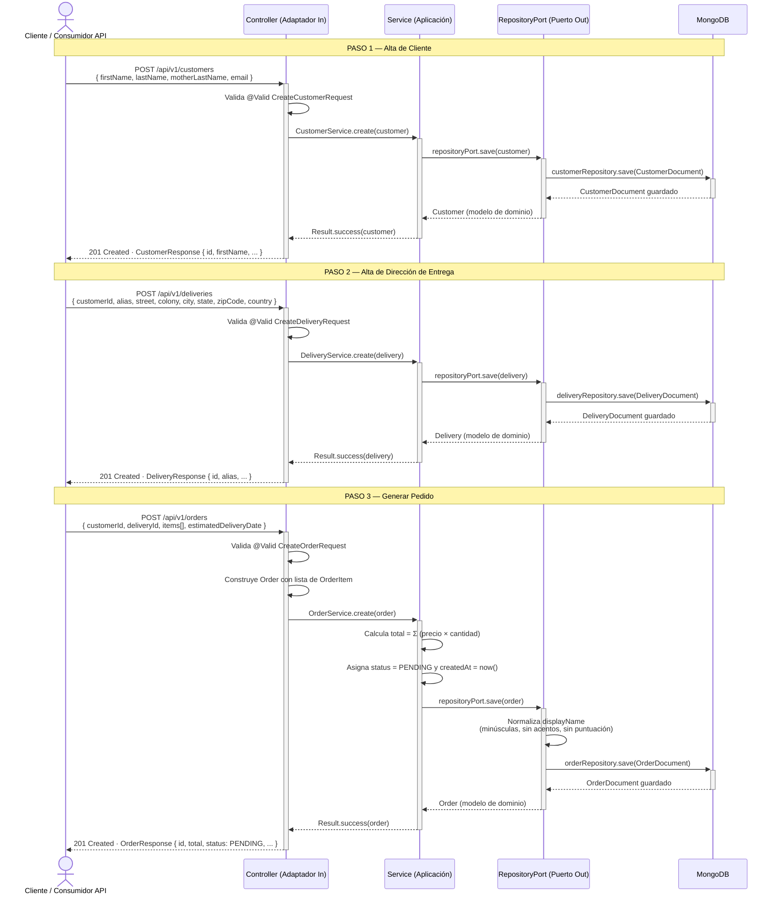
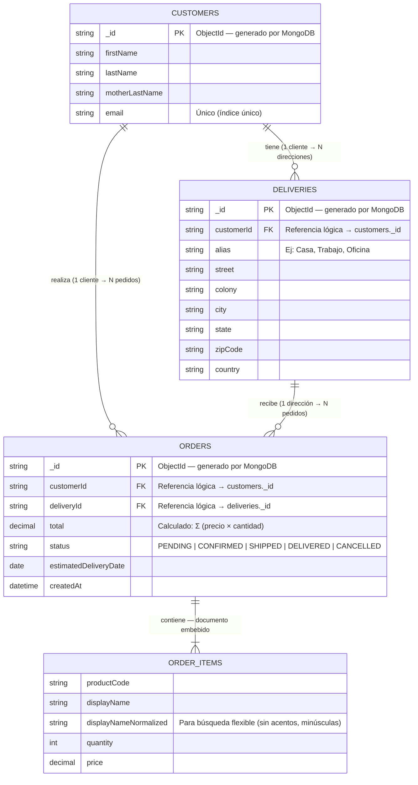

# Diagramas — mso-ventas-liverpool

> Microservicio de gestión de ventas construido con Spring Boot 4 y Arquitectura Hexagonal.

---

## 1. Diagrama de Secuencia — Flujo de negocio

Muestra el proceso completo: alta de cliente → alta de dirección de entrega → generación de pedido.
Cada paso atraviesa las capas de la Arquitectura Hexagonal: REST → Aplicación → Puerto de salida → MongoDB.

---

## 2. Diagrama ER — Colecciones MongoDB

MongoDB no tiene claves foráneas reales; las relaciones son **referencias lógicas** mediante el campo `_id`.
`ORDER_ITEMS` es un **documento embebido** dentro de `ORDERS` (no una colección separada).

